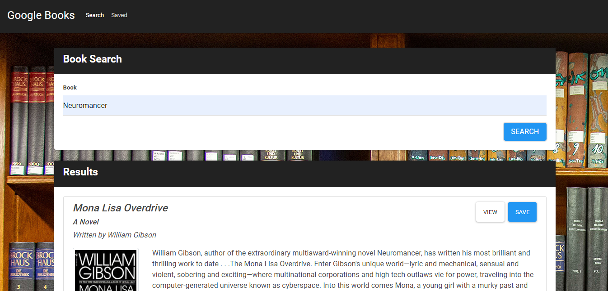

# React Google Books Search

## Table of Contents

* [Description](#description)
* [Technologies](#technologies-used)
* [Usage](#usage)
* [Contribution Guidelines](#contribution-guidelines)
* [License](#license)
* [Questions](#questions)
    
## Description
A React app that searched for books using the Google Books API and save them to a user list

## Technologies Used

React

MongoDB

Express

Node.js

## Usage
Used as a web application in most browsers

## Contribution Guidelines
No contributions permitted

## License
*This project uses the MIT license.*

*Read more about it by clicking the link below*

[License Link](https://choosealicense.com/licenses/mit/)

## Questions
[Github Profile](https://github.com/burtk33)

I can be reached via email at burtk33@gmail.com
